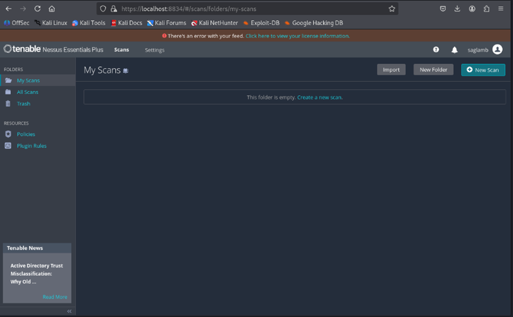
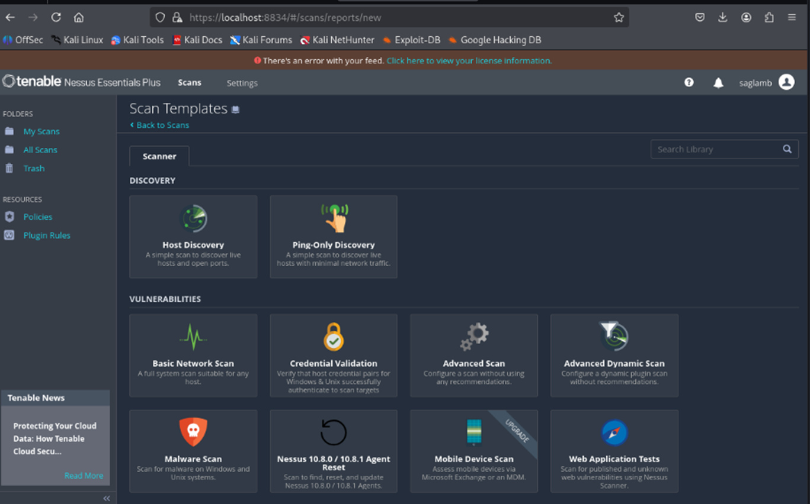
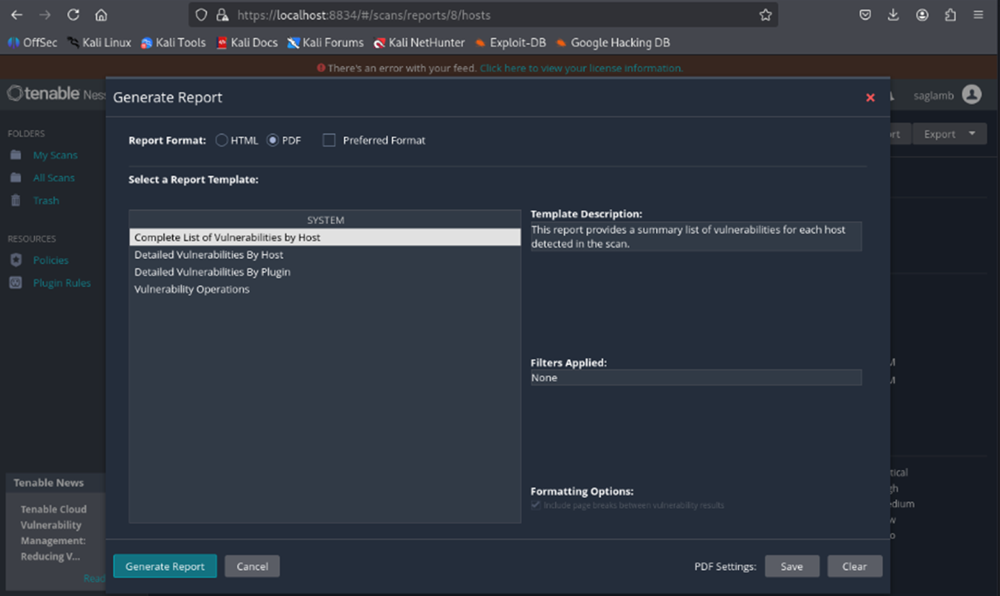

# Nessus-Lab-Portfolio
A vulnerability scanning lab using Tenable Nessus Essentials on Kali Linux. This project includes installation, network scan configuration, and analysis of vulnerabilities across multiple virtual machines as part of a cybersecurity lab.

## Tools Used
- Tenable Nessus Essentials
- Kali Linux
- Virtual Machines 
- Browser access via `https://localhost:8834`

## What Was Done
- Downloaded and installed Nessus for Linux (Ubuntu)
- Initialized the setup and completed plugin installation
- Created a scan configuration using the **Advanced Scan** template
- Targeted multiple local IPs (`10.0.2.15`, `10.0.2.3`, `10.0.2.2`)
- Generated a detailed PDF report of the scan results

## Screenshots 
## Screenshots

Here are the key steps demonstrated with screenshots:

1. **Downloading Nessus**
   

2. **Initializing Nessus**
   

3. **Starting a New Scan**
   

4. **Scan Configuration**
   

5. **Advanced Scan Execution**
   

6. **Scan Results**
   

7. **Report Template Selection**
   

## Report File
You can view the full vulnerability scan report [here](nessus_report.pdf)

